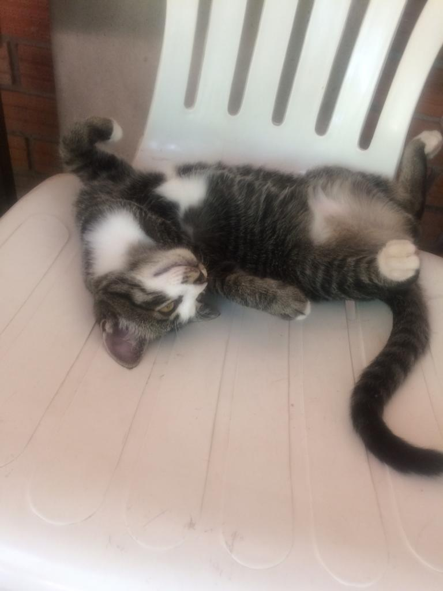

<figure>
	
	<figcaption>Watching the ripples</figcaption>
</figure>

<figure>
	
	<figcaption>Home sweet home, at sunrise</figcaption>
</figure>

<figure>
	
	<figcaption>Tea zone. And a rooster.</figcaption>
</figure>

<figure>
	
	<figcaption>It was a half moon, hanging out with Venus among the coconut trees. The camera sees it as a full moon, though.</figcaption>
</figure>

<figure>
	
	<figcaption>A little cabin where the monks can rest</figcaption>
</figure>

<figure>
	
	<figcaption>Sunset coconuts</figcaption>
</figure>

<figure>
	
	<figcaption>Silly kitten</figcaption>
</figure>

<figure>
	
	<figcaption>Preparing to sally forth, across the drunken bridge</figcaption>
</figure>

<figure>
	
	<figcaption>The original trunk rots, enmeshed in living trunklings of the same tree. Many of us cling to the past, but this Banyan tree has made dramatic show of it. </figcaption>
</figure>

