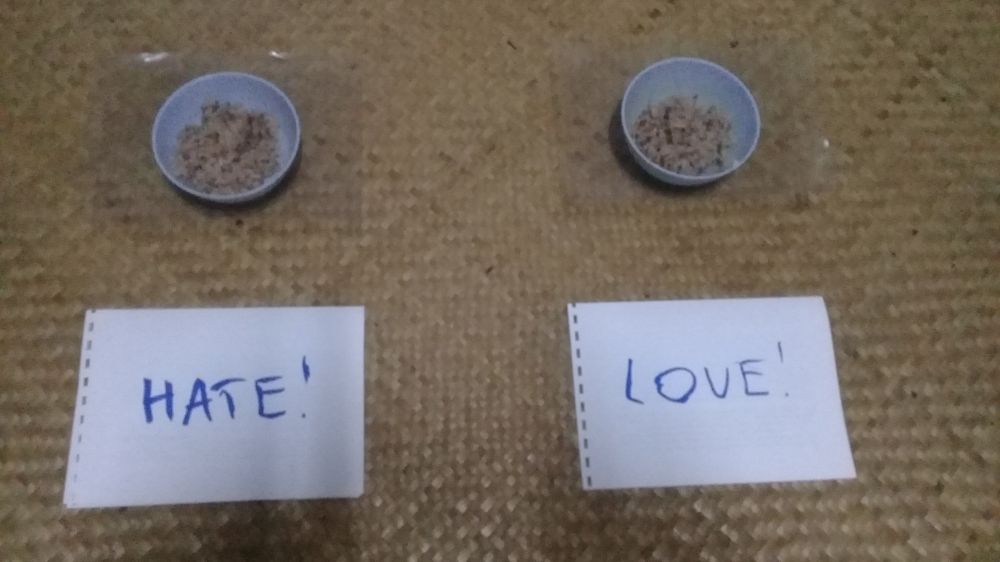
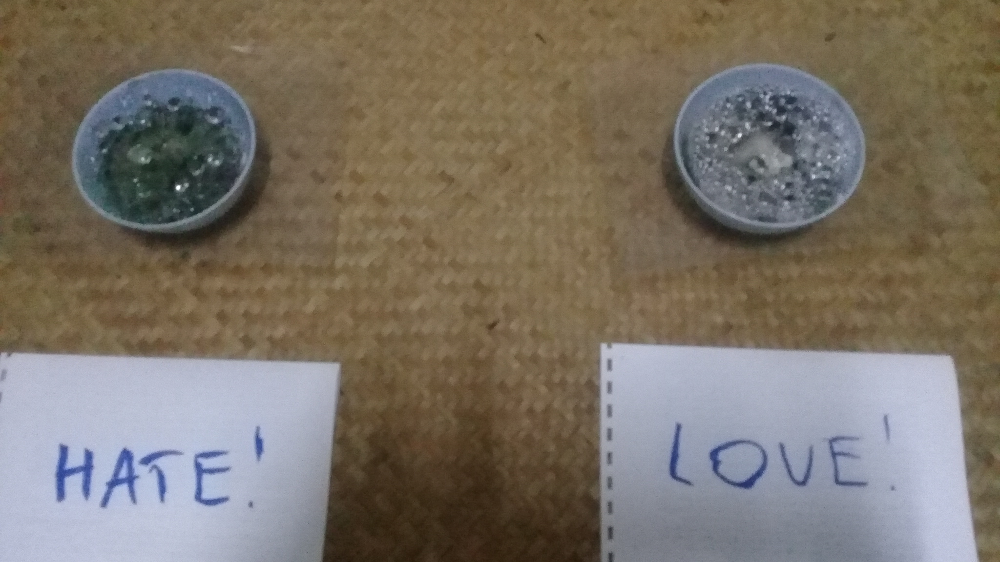
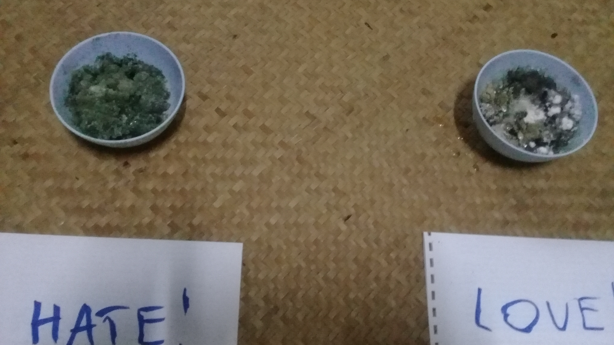

# Abstract

The two researchers held conflicting views about the effect of love and hate on the decay of rice. As a game, we made our own test. Despite the arrival of empirical evidence, neither researcher changed their view. Western and Buddhist psychology each offer potentially helpful explanations and remedies for stuck views.

**Authors:**  Tõnn Sarv, Erik Wyatt

# Introduction

> Smart people believe weird things because they are skilled at defending beliefs they arrived at for non-smart reasons.
>
> —[Michael Shermer](https://en.wikipedia.org/wiki/Michael_Shermer)

Online, claims circulate that kindness to rice can stop the rice's decay. This originated from the work of Masaru Emoto with attitude and snowflakes. When he published an experiment with decaying rice, that was easy to try at home, it spread widely.

<figure>
	
	<figcaption>Results of a similar experiment (from "Power of Positivity")</figcaption>
</figure>

Such claims have yet to be published in a journal of repute and seem pseudoscientific, however are nonetheless quite popular. As a game or a bet, we decided to make our own pseudoscientific investigation into the matter.

One researcher, A,  held the hypothesis that repeatedly loved rice would decay slower or not at all than repeatedly hated rice, because the water responds to human attitudes. The other researcher, B, thought that there would be no noticeable difference in the rice's decay, regardless of the researchers' attitudes, because rice lacks the usual mechanisms for comprehending attitude.

# Materials and Methods

We collected two bowls of brown rice from the same rice pot. We covered each with a sheet of plastic glued to the rim of the bowl, and placed them side by side on a spare bed. One bowl we labeled "Hate", the other "Love". Every day (except one holiday) we visited the rice bowls. We insulted the "Hate" rice and praised the "Love" rice, usually out loud. After one week, we melted a hole in the center of each plastic sheet, because nothing was visibly happening. One month after the start of the experiment, we offered both rice bowls to the chickens.

# Results

## In the Rice

<figure>
	
	<figcaption>Day 1</figcaption>
</figure>

<figure>
	
	<figcaption>Day 30</figcaption>
</figure>

<figure>
	
	<figcaption>Day 30, without the covers</figcaption>
</figure>

The "Hate" rice grew greenish black mold, while "Love" rice grew a grayscale rainbow of mold types. The "Hate" rice started to mold 2-3 days earlier than the "Love" rice. The "Hate" rice formed a few large drops of condensation, while the "Love" rice initially had small condensation droplets, that merged into large droplets only in the center of the plastic sheet and quite late in the course of the experiment.

The chickens passed up both bowls.

## In the Experimenters

Despite empirical evidence, neither researcher changed their view. Further, A saw the two bowls as extremely different, while B saw the bowls as quite similar.

# Conclusion

## In Terms of Rice

Since both our bowls rotted, our results do not support the claim most commonly made online, that kindness can halt rice's decay for one month. 

There is still a possibility that the researchers' attitudes had a lesser effect. Because there was only one sample in each group, we cannot say conclusively whether the differences in color, condensation and timing were chance, or caused by the researchers' attitudes.

## In Terms of Western Psychology

We viewed the same rice bowls differently because of confirmation bias, which colors our perceptions based on our prior beliefs, desired outcomes, and emotional commitments. The way out is gather more data and use rigorous methods to analyze it objectively.

## In Terms of Buddhist Psychology

Our perceptions ([*sañña*)](https://en.wikipedia.org/wiki/Samjna) of the rice bowls derive from the intersection of our awareness [(*viññāna*)](https://en.wikipedia.org/wiki/Vijnana), our eyes, and the material world [(*rūpa*)](https://en.wikipedia.org/wiki/Rūpa). Our awareness is shaped by our intentions [(*saṅkhāra*)](https://en.wikipedia.org/wiki/Sankhara). Our intentions arise because we do not realize [(*avijjā*)](https://en.wikipedia.org/wiki/Avijj%C4%81) that the whole process will lead to stress [(*dukkha*)](https://en.wikipedia.org/wiki/Dukkha). The way out is to understand that clinging to a particular way of seeing the rice bowls is inherently stressful and not worthwhile. The only necessary views are those leading to the end of stress.

## Closing Remarks

The Western approach aims at accuracy; the Buddhist approach at stress-free life. Each is adapted for its purpose.

As for the bowls of rice themselves, well, they were never that important anyway.

# Bibliography

https://en.wikipedia.org/wiki/Debiasing

https://en.wikipedia.org/wiki/Confirmation_bias#Biased_interpretation

https://en.wikipedia.org/wiki/Prat%C4%ABtyasamutp%C4%81da

https://en.wikipedia.org/wiki/Skandha#In_Theravada_Abhidhamma

https://yayyayskitchen.com/2017/02/02/30-days-of-love-hate-and-indifference-rice-and-water-experiment-1/

https://www.powerofpositivity.com/scientific-proof-the-power-of-positivity-alters-our-physical-world/

The Mirror of Insight, by Thanissaro Bhikkhu.

The Hidden Messages in Water by Masaru Emoto

